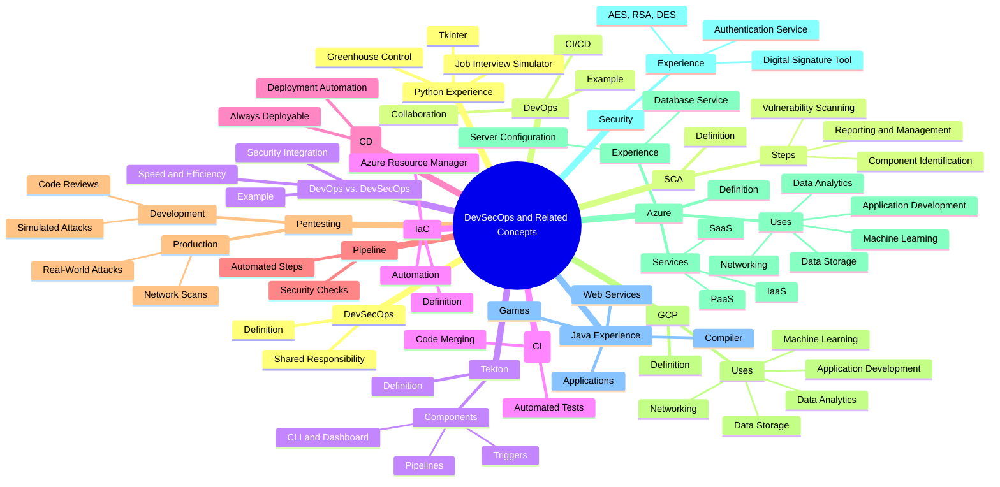

# DevSecOps

**DevSecOps** stands for **Development, Security, and Operations**. It's like DevOps but integrates security into every stage of the software development lifecycle. The main characteristic is that security is a shared responsibility among all members of the development and operations teams, rather than being handled by a separate security team at the end of the development process.

## DevOps

In general, **DevOps** aims to improve collaboration between teams to speed up software delivery. It emphasizes automation, continuous delivery, and integration (CI/CD) to streamline the development pipeline.

I heard about DevOps from a friend of mine. He told me how his team used Java to write new features and fix bugs for a Personal Finances App. In **Continuous Integration**, the team merged their code into a GitLab repository, then ran automated tests to ensure new code didn't break existing functionality. In **Continuous Delivery**, once the code passed all tests, it was automatically deployed to a staging environment for further testing. The operations team then monitored the app's performance and handled any issues that arose in production. Finally, the security team performed security checks before the app was released to users, addressing any vulnerabilities found at this stage.

## DevOps vs. DevSecOps

**DevOps** focuses on speed and efficiency, with security often added at the end. On the other hand, **DevSecOps** integrates security into every step, making it a priority from the start.

For example, when a ship is being built, a captain sends the best crew members to ensure the ship is strong and ready to face any storm or pirate attack, making security a responsibility for everyone.

## Continuous Integration (CI)

**Developers merge their code changes into a shared repository**. Each time code is merged, automated tests run to catch any bugs or issues early. This ensures that the codebase remains stable and functional.

## Continuous Delivery (CD)

It comes after CI and **automates the process of deploying code changes to a staging or production environment**. This means the software is always in a deployable state, and updates can be released quickly and reliably. It's like a document that is automatically formatted and ready to be printed.

## Pipeline

A **pipeline** is a series of automated steps that take the code from the developer's computer to the production environment. It ensures that every piece of code is tested and checked for security, so it can be sent to production without any trouble.

## Pentesting

**Pentesting**, or **Penetration Testing**, involves testing the security of an application or system while it's still being built. This helps identify and fix security vulnerabilities during the development process.

### In Development

- **Security experts simulate attacks on the system to find weaknesses**. These tests can include code reviews, vulnerability scans, and manual testing.

### In Production

- This ensures that the live system is secure and can withstand real-world attacks. The attacks can include network scans, application testing, and social engineering attacks.

## GCP

**Google Cloud Platform (GCP)** is a suite of cloud computing services provided by Google. It offers a range of services including computing power, storage, databases, machine learning, and networking, all hosted on Google's infrastructure.

### Uses

- **Application development**
- **Data storage and management**
- **Machine learning and AI**
- **Data analytics**
- **Networking**

In summary, GCP provides a comprehensive set of tools and services to help businesses build, deploy, and scale applications efficiently and securely.

## Azure

**Azure** offers a wide range of cloud services by Microsoft, including computing, analytics, storage, and networking. It provides Infrastructure-as-a-Service (IaaS), Platform-as-a-Service (PaaS), and Software-as-a-Service (SaaS) options.

### What Can Be Done with Azure

- **Application development**
- **Data storage and management**
- **Machine learning and AI**
- **Data analytics**
- **Networking**

### My Experience with Azure

I used Azure in a Distributed Systems subject. I learned to configure servers and worked with both Ubuntu Servers and Windows Servers. I created system images and set up a database service. Fortunately, I never had a virtual machine running without knowing it.

## Security

### My Experience with Security

I've developed an application that provides an authentication service and a digital signature tool. I used the AES cipher algorithm but am also familiar with RSA and DES.

I actually created a DES cipher from scratch in high school using Java, which was quite challenging.

## My Java Experience

Java was the first programming language I learned. I've developed web services, web applications, desktop applications (such as a photo editor), mobile applications, some basic games, and even a compiler.

## My Python Experience

Python is my favorite language. I developed my bachelor's final project using Python, which was a job interview simulator that scans your face with facial recognition technologies and provides a report on the emotions you displayed during the simulation to help improve your soft skills.

I've used Tkinter (a Python framework) extensively to design graphical interfaces. I also created a control panel to manage a greenhouse using a humidity sensor, a ventilator, and an irrigation system.

## SCA

**Software Composition Analysis (SCA)** is a security practice used to identify and manage vulnerabilities in the software components that make up an application. It examines open-source libraries and third-party code to detect any known security vulnerabilities, ensuring all components are secure and up-to-date, reducing the risk of security breaches.

SCA tools scan the application to identify all the software components and create an inventory, often referred to as a Software Bill of Materials. The tools check each component against known vulnerability databases, such as the Common Vulnerabilities and Exposures (CVE) database. The results are compiled into a report, highlighting any vulnerabilities and providing recommendations.

### Steps

- **Component identification**
- **Vulnerability scanning**
- **Reporting and management**

SCA also ensures that the software complies with security standards and regulations and provides ongoing monitoring of software components to detect new vulnerabilities as they arise.

## Tekton

**Tekton** is an open-source framework for creating Continuous Integration and Continuous Delivery (CI/CD) systems. It builds, tests, and deploys applications across various environments. It contains components such as pipelines, triggers, CLI, and dashboards.

### How It Works

- **Pipelines**: Provide building blocks for defining CI/CD workflows. These pipelines are made up of tasks that can be reused and customized.
- **Triggers**: Allow pipelines to be automatically started based on events, such as a new code commit or a pull request.
- **CLI and Dashboard**: The Command-Line Interface (CLI) and dashboard provide tools for managing and visualizing the execution of pipelines.

## IaC

**Infrastructure as Code (IaC)** is a practice where infrastructure is provisioned and managed using code, rather than through manual processes. You can define your infrastructure with code, allowing you to version it, test it, and reuse it. This automates the setup and management of infrastructure, making it consistent, repeatable, and efficient.

Azure has "Azure Resource Manager," which allows you to define and manage infrastructure using code.

---

### Interview Script Tips

1. **Confidence**: Speak clearly and confidently. Practice your script multiple times to become comfortable with the content.
2. **Eye Contact**: Maintain eye contact with the interviewer to show engagement and confidence.
3. **Body Language**: Use positive body language, such as nodding and smiling, to convey enthusiasm.
4. **Examples**: Be ready to provide real-life examples or experiences related to the topics you're discussing.
5. **Questions**: Prepare a few questions to ask the interviewer about the company or the role, showing your interest and engagement.

Good luck with your interview! If you need any more help, feel free to ask.

## Questions About the Role

- Can you describe a typical day or week in this role?
- What are the most immediate projects that need to be addressed?
- What are the key challenges someone in this role would face?

## Questions About the Team and Leadership

- Can you tell me more about the team I would be working with?
- How does the team typically collaborate on projects?
- What is the management style of the person I would be reporting to?

## Questions About Growth and Development

- What opportunities for professional development does the company offer?
- How do you measure success in this role?
- Are there opportunities for advancement within the company?

## Questions About the Company’s Goals and Culture

- What are the company’s goals for the next year?
- How would you describe the company culture?
- What do you enjoy most about working here?

## Questions to Build a Relationship with the Interviewer

- How long have you been with the company, and what has your experience been like?
- What excites you most about the company’s future?
- Can you share any recent successes or milestones the team has achieved?

## Closing Questions

- What are the next steps in the interview process?
- Is there anything else you need from me to help make your decision?
- Do you have any concerns about my qualifications that I can address?
