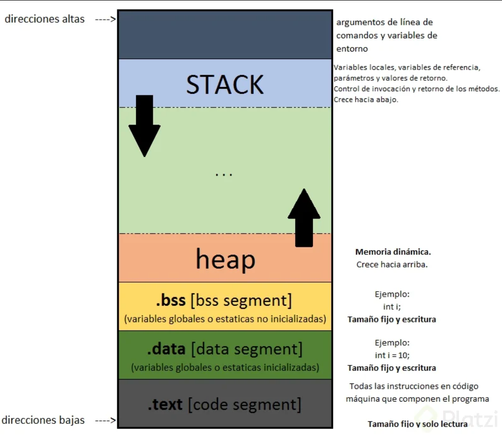

# Manejo de memoria

## Conexión entre **`CPU`** y **`RAM`**

Las computadoras cuentan con una **`CPU`** (*Computer Logic Unit*) y una **`RAM`** (*Random Access Memory*).

La **`CPU`** es la parte de la computadora que realiza todas las operaciones matemáticas, lógicas y de control de un programa. Es la maquinaria central, se puede decir que es el “cerebro” de la computadora.

La **`RAM`**, o memoria, es donde se almacenan todos los datos de un programa, desde el código que se va a ejecutar hasta las variables que se van utilizando durante la ejecución.


Estos dos componentes se comunican de forma constante. La **`RAM`** contiene el código que se ejecuta, así que la **`CPU`** se comunica con la memoria accediendo a cada registro donde se almacenan los datos del programa.

## Segmentación de memoria

La **RAM** tiene cierta segmentación. El sistema operativo realiza una gestión de recursos para que, cuando un programa se ejecuta, se aparte un espacio dentro de la memoria **RAM** donde se cargan y almacenan todos los datos relacionados.

C y C++ realizan una segmentación estándar que se divide en 5 secciones:

1. **Instrucciones**: Almacena el **código ejecutable**. Todas las instrucciones que se generan después de compilar el programa se almacenan aquí.
2. **Literales**: Almacena **literales no ejecutables**, valores constantes que no cambian a lo largo de la ejecución. De este modo, los datos que son de tipo literal no necesitan alojarse en ninguna otra parte de la memoria. Por ejemplo, las cadenas:

```c++
cout << "Hola mundo"
```

1. **Datos estáticos**: Almacena las **variables declaradas**. Las variables que hayas declarado, ya sean de tipo cadena, carácter, entero, etc., van a reservar su espacio. El compilador reserva un espacio de tamaño definido (o estático) por el tipo de variables (por ejemplo, una variable de tipo `int` ocupa 4 bytes).
2. **Heap**: También se le llama ***montón*** y es controlado por el programador. Este crece conforme crecen los números de la dirección de memoria, mediante funciones de almacenamiento de memoria dinámica.
3. **Stack**: Se traduce como ***pila*** y es gestionado principalmente por el compilador. Cuando el compilador interpreta los distintos bloques y funciones de un programa, mantiene en la memoria información para saber desde dónde se llamó cierta función, qué datos contiene internamente, etc.


> 📝 **Nota:** Los diferentes lenguajes de programación suelen realizar la segmentación de forma similar, aunque no siempre es la misma.

## Diferencias entre stack y heap

La memoria **Heap** y la memoria **Stack**, forman parte de la **memoria dinámica**, crecen en sentido contrario. El espacio intermedio entre ambas es un espacio que reserva el sistema operativo solicitado por el compilador. De esta forma, podemos crecer en la cantidad de datos que estamos usando durante la ejecución del programa, ya que hay casos en los que no se sabe con precisión cuántos datos se van a utilizar y, por tanto, no se sabe qué tamaño de memoria reservar. Por lo tanto, se reserva un espacio bastante amplio.

Para evitar que colisionen, se trata de que crezcan en direcciones opuestas y se acerquen al centro del espacio vacío, teóricamente sin encontrarse nunca. Sin embargo, si se llegan a encontrar, se provoca algo conocido como **desbordamiento de memoria**, un bug muy conocido en lenguajes compilados como C y C++.



| **Parámetro** [1] | **Slack (pila)** | **Heap (montón)** |
| :--- | :--- | :--- |
| **Tipo de estructura de datos** | Lineal | Jerárquica |
| **Velocidad de acceso** | Acceso de alta velocidad | Más lento en comparación con la pila |
| **Gestión del espacio** | Es un espacio administrado eficientemente por el sistema operativo para que la memoria nunca se fragmente. | El espacio de pila no se usa de manera tan eficiente. La memoria puede fragmentarse como bloques de memoria asignados y liberados. |
| **Acceso** | Solo variables locales. | Permite acceder a variables de forma global. |
| **Límite de tamaño** | El límite depende del sistema operativo | No tiene un límite específico |
| **Redimensión** | Las variables no pueden cambiar de tamaño. | Las variables pueden cambiar de tamaño. |
| **Asignación de memoria** | La memoria se asigna en un bloque contiguo. | La memoria se asigna en cualquier orden aleatorio. |
| **Asignación y desasignación** | Se realiza automáticamente mediante instrucciones del compilador. | Lo hace manualmente el programador. |
| **Desasignación** | No requiere desasignar variables. | Se necesita una desasignación explícita. |
| **Coste** | Menor. | Mayor. |
| **Implementación** | Matrices simples, memoria dinámica y basada en listas vinculadas. | Matrices y árboles. |
| **Mayor problema** | Escasez de memoria. | Fragmentación de la memoria. |
| **Localidad de referencia** | Instrucciones automáticas en tiempo de compilación. | Adecuado. |
| **Flexibilidad** | Tamaño fijo. | Redimensionable. |
| **Tiempo de acceso** | Más rápido. | Más lento. |

<!-- Referencias -->

[1]: <https://docs.hektorprofe.net/cpp/07-punteros-memoria/06-tipos-memoria-stack-heap/> "Tipos de memoria"
