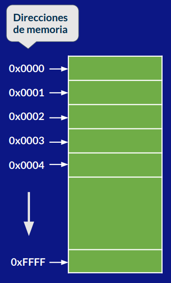
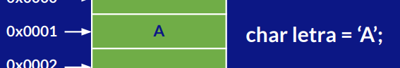
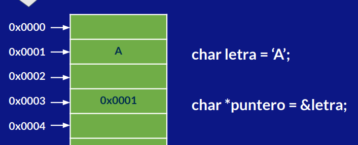
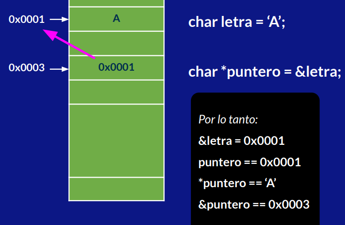

# Punteros

Los punteros **son un tipo especial de variable que almacena direcciones de memoria**. Sirven para el manejo de **memoria dinámica**, la cual es la que puede cambiar de tamañao a lo largo de la ejecución del programa.

## Estrucutra básica de la RAM



Se puede observar que la estrucutura básica de la ram es como una tabla o lista. Cada celda es donde se alamcenan los datos, tiene asignada una dirección de memoria que es unica e irrepetible.

De esta forma, se puede acceder a una variable por medio de su dirección. Por ejemplo, una varbalde de tipo `char`.



Se reserva un espacio en la memoria RAM, el compilador sabe que se trata de una letra ya que se le indico el tipo de dato, se hace una asiganción con `'A'`. Guandolo en la dirección `0x0001`.

## Puntero a una variable

C++ permite usar los símbolos `*` y `&` para manejo de memoria.

Si queremos almacenar un puntero a una variable que almacena un caracter, por ejemplo, podemos utilizar el tipo `char` (se puede hacer con cualquier tipo de dato). Se inicia el nombre de la variable con un asterísco.

```c++
char *puntero;
```

Para asignar la direccion de memoria de una variable ya existente, consultas la direccion utilizando el símbolo `&` y luego ponienod el nombre de la variable a la que le vas a consultar la dirección.

```c
char *puntero = &letra;
```

De esta forma, estamos tomando la variable puntero, se le reserva un espacio en memoria y se le asigna un valor, la dirección de memoria de la variable letra.



Si la variable puntero esta apuntando a la dirección de memoria `0x0001` y el valor que esta almacenado en esa dirección cambia, el puntero podra ver ese cambio del valor.

> **Puedes obtener un valor por medio de su referecnia de direccion en lugar de leer directamente el valor.**
> 
