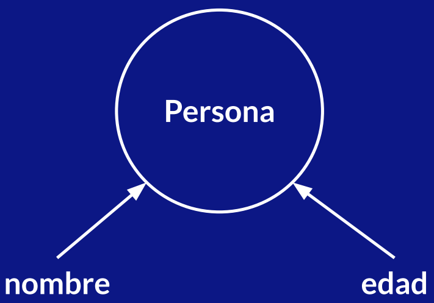
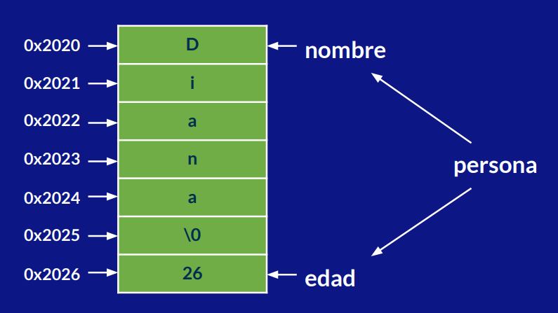
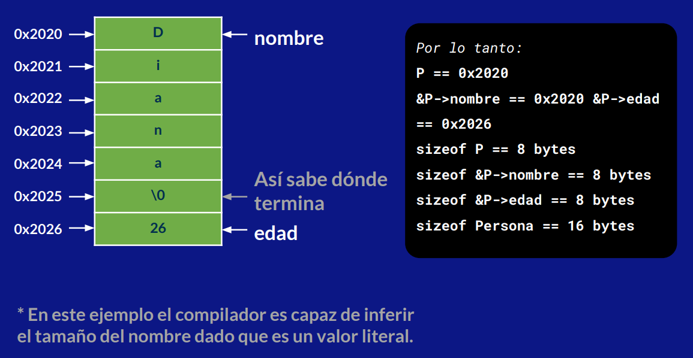

# Estructuras de datos

Hasta el momento se han visto variables de tamaño fijo, y listas para colecciones o variables de tamaño variable. Sin embargo, solo se pueden hacer listas con elementos de un mismo tipo.

Existen formar de definir tus propias estrucuturas de datos y tipos personalizados para poder utilizarlos drurante la ejecicuón del programa y haciendolo versatil. Esto es gracias a los punteros.

## Ejemplo

Recordando una lista de caracteres se crea de la siguiente forma:

```c++
char texto[] = "hola";
```

Otra forma menos abreviada sería la siguiente:

```c++
char texto[] = {'h', 'o', 'l', 'a'};
```

Dentro de la memoria, la computadora guarda cada elemento en un espacio de memoria distinto. Por lo que podemos hacer una forma de declarar una lista de carácteres con punteros.

```c++
char *texto = (char *)"hola";
```

Cada letra se almacena en un registro de memoria.

## Estrucuturas personalizadas

A veces, se necesitan usar estrucuturas más complejas. Por ejemplo, si se piensa en una entidad, como una persona, esta puede tener varios datos/propiedades/carácteristicas como su nombre y su edad que nos pueden ser de utilidad en el sistema.



Se crean estrucuturas para almacenar estos campos. La forman en que se almacenarían es la siguiente:



Se tiene una seccion destinada para la estrucutura que se divide en dos: nombre y edad. La palabra correpondiente al nombre guarda cada carácter en un espacio y la edad ocupa solo un espacio. Algo curioso, es que si se desea obtener la direccion de memoria de la estrucutura Persona, coincidiria con la direccion de memoria inicial del nombre.

En código, la esctrutura se declara de la siguiente forma:

```c++
struct Persona {
    string nombre;
    int edad;
};

// Declaración de variable
Persona p0;
// Inicialización de variable
Persona p1 = Persona();
// Inciialización con memoria dinámica
Persona *p2 = new Persona();
```

Cuando la variable se inicializa como puntero, se esta manejando como memoria dinámica. De esta forma en vez de generar la estrucutura durante la compilación, la genera durante la ejecución. También se diferencian en la sintaxis.

### Estructura con memoria estática

```c++
// Inicialización de variable
Persona p1 = Persona();
p1.nombre = "Diana";
p1.edad = 26;
cout << p1.nombre << endl;
cout << p1.edad << endl;
```

### Estructura con memoria dinámica

```c++
// Inicialización con memoria dinámica
Persona *P = new Persona();
P->nombre = "Diana";
P->edad = 26;
cout << P->nombre << endl;
cout << P->edad << endl;
```

> 📝 **Nota:** La palabra reservada `new` reserva el espacio necesario en memoria.
>
> El operador `->` direcciona al puntero del valor miembro.

La representación en memoria, sería la siguiente:



## Uniones y enumeraciones

Son estrcuturas que se usan para ahorrar espacio de memoria en la RAM para almacenar datos que sabemos qu epueden compartir la memoria porque sabemos que no van a existir al mismo tiempo.

### Uniones

Las uniones son un tipo de estrucutra para almacenar diferentes valores en el mismo espacio de memoria. Por ejemplo, una union para almacer un número o una letra.

```c++
union numero_letra {
    int numero;
    char letra;
};

numero_letra x = {'A'}
```

En este caso podemos manipular `x`como un número y cómo una letra.

```c++
cout << " x como número: " << x.numero << endl;
cout << " x como letra: " << x.letra << endl;
```

## Enumeraciones

De la misma manera que `union`, `enum` nos sirve ara ahorrar memoria utilizando el mismo registro dentro de la memoria RAM. Su utilidad es almacenar un valor de varios que puede tener una variable. Por ejemplo, día de la semana en una misma variable.

Se escriben los valores posibles que puede llegar a tener una variable:

```c++
enum dias_semanas {lunes, martes, miercoles}
```

Por default, se maneja como una lista ordenada de números

```c++
dias_semana dia = martes;
cout << dia << endl;
```

Se puede cambiar el comportamiento para tener un valor no numérico, por medio de equivalencias como un carácter.

```c++
enum dias_semanas {lunes='l', marte='m', miercoles='x'}
dias_semana dia = martes;
cout << (char) dia << endl;
```

Tanto las enumeraciones como las uniones son utiles cuando se quiere optimizar el espacio de memoria. Podemos almacenar en el mismo registro de la memoria RAM todos los datos que puedan a llegar a suceder para una variable.
