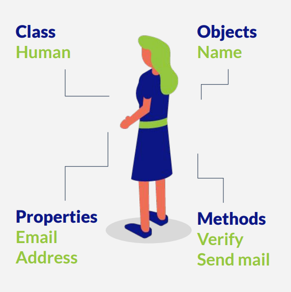

# Introducción a la Programación Orientada a Objetos

Es la gran diferencia entre C y C++. Es el paradigma que Jern Strolldtruft agregó al compilador de C para crear C++.

## ¿Qué es la POO?

Un **objeto** es una **entidad** que puede existir en el mundo físico o no. Cumple con ciertas carácteristicas:

- ***Class***. Tiene una **clase**, es decir es cierto tipo de objeto.
- ***Object***. Da una identidad.
- ***Properties***. Son carácteristicas que son descriptivas.
- ***Method***. Son las acciones que el objeto puede hacer.

En POO se busca escribir programas pensando en entidades y cómo estas funcionan y colaboran para intercambiar información. Por ejemplo, si quisieramos modelar en una empresa a una Persona podemos decir que esta tiene un correo electrónico institucional, que puede realziar acciones como enviar correos, etc.




A diferencia de una estrucutura de datos, ya no solo almacenamos información, si no que también se agrea un coportamiento a la identidad de cada objeto/entidad.

En C++, así como en otros lenguajes, la POO es una serie de conceptos que se implementan al momento de programar.

## Abstracción

Es la capacidad de realizar programas a partir de definiciones abstractas, por medio de solo mostrar la información esencial y ocultar los detalles de implemetación.

## Encapsulación

Es la capacidad de agrupar datos bajo una misma unidad.

Una clase puede ocultar características para hacerlas inaccesibles a los demás.

## Implementación

Un objeto inicia como una clase, una clase se declara con la palabra reservada `class`. La forma de encapsular los atributos de una clase de manera que se puedan acceder en cualquier parte del programa es cusando la palabra reservada `public`.

```c++
class Persona {
public:
    // Propiedades
    string nombre = "Diana";
    int edad = 26;
};
```

Se puede hacer uso de memoria estática o dinámica, de la misam forma que con las estrucuturas de datos.

```c++
// Forma estatica
Persona p = Persona();
cout << p.nombre << endl;

// Forma dinámica
Persona *P = new Persona();
cout << P->nombre << endl;
```

Se puede añadir comportamiento a los objetos, en este caso se agrega la función **`saludar()`**.

```c++
class Persona {
public:
// Propiedades
string nombre = "Diana";
int edad = 26;

// Comportamiento
void saludar() {
    cout << "Hola! Soy " << nombre << endl;
}
};

int main() {
    // Forma estatica
    Persona p = Persona();
    p.saludar();

    // Forma dinámica
    Persona *P = new Persona();
    P->saludar();

    return 0;
}
```

Las ventajas de implementar comportamiento a los objetos es que se les puede asignar un comportamiento individual a cada objeto.

Puede verse el ejemplo implemetado [aqui](./05-clasePersona.cpp)

## Ciclo de vida de un objeto

Como ya mencionó, **un objeto es una entidad**, pero al mismo tiempo es una estructura que se va a almacenar en memoria. Entonces, a lo largo de su proceso pasa por diferentes estados. Se sigue el siguiente ciclo:

- Se reserva el espacio en memoria. Sucede cuando se realiza una asignación, por ejemplo, utilizando la palabra reservada `new` hacia un puntero que puede almacenar el objeto.

```c++
Objeto *o = new Objeto();
```

- Se invoca el **constructor**. Una función que tiene todo objeto que se usa para inicializar todos los valores necesarios dentro del objeto. No retornan datos, y deben tener el mismo nombre de la clase.

```c++
//Constructor
Objeto(int a, int b, char c) {
    // Inicializa
    A = a; B = b; C = c;
}
```

- **Periodo de actividad**. Ciclo donde el objeto va a existir dentro de memoria todo el tiempo que sea necesario.
- Se invoca el **destructor**. Se invoca cuando ya no se necesita el objeto, el compilador por defecto tiene un destructor "vacio" que hace hace la función básica (no retorna ni recibe valores) de liberar toda la memoria que el mismo compilador reserva cuando crea el objeto. Es buena práctica usarlo al manejar memoria dinámica.

```c++
~Objeto() {
    cout << "Adios!" << endl;
}
```

> ⚠️ **Cuidado:** C++ no tiene un recolector de basura que elimine todas esas variables o información que ya no se este utilizando. Por lo que debemos limpiar la memoria de forma manual.
>
> Ya sea usando el destructor de forma automatica (cuando ternima el programa) o de forma manual usando la sentencia `delete`. Hay un ejemplo en el archivo [**`06-clasePersona.cpp`**](./06-clasePersona.cpp)

- Se **libera** el espacio en memoria. Una vez se invoca el destructor, se asume que la memoria ya esta desocupada.
